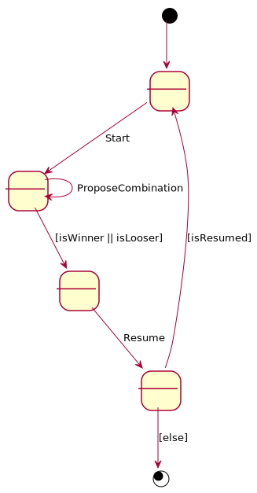

# Mastermind. Requisitos Básica
Universo Santa Tecla  
[uSantaTecla@gmail.com](mailto:uSantaTecla@gmail.com)  
  
**Índice**

1. [Requisitos](#requisitos)  
2. [Vista de Casos de Uso](#vista-de-casos-de-uso)  
2.1. [Prototipo de Interfaz](#prototipo-de-interfaz)  
2.1.1. [Partida ganada](#partida-ganada)  
2.1.2. [Partida perdida](#partida-perdida)  

## Requisitos  

| [Wiki](https://en.wikipedia.org/wiki/Mastermind_(board_game)) - [Youtube](https://www.youtube.com/watch?v=2-hTeg2M6GQ&ab_channel=ViciadosMesa)<br/> * _Funcionalidad: **Básica**_<br/>  * _Interfaz: **Texto**_<br/>  * _Distribución: **Standalone**_<br/>  * _Persistencia: **No**_<br/> |  | 
| :------- | :------: |  

## Vista de Casos de Uso  

| Diagrama de Actores y Casos de Uso | Diagrama de Contexto |
|---|---|
|  |  |  

### Prototipo de Interfaz
  
#### Partida ganada
```
----- MASTERMIND -----
0 attempt(s):
xxxx
Propose a combination: rybgpo
Wrong proposed combination length
Propose a combination: rybÑ
Wrong colors, they must be: rbygop
Propose a combination: rybo


1 attempt(s):
xxxx
rybo --> 1 blacks and 1 whites
Propose a combination: byro


2 attempt(s):
xxxx
rybo --> 1 blacks and 1 whites
byro --> 2 blacks and 0 whites
Propose a combination: pgro


3 attempt(s):
xxxx
rybo --> 1 blacks and 1 whites
byro --> 2 blacks and 0 whites
pgro --> 4 blacks and 0 whites
You've won!!! ;-)
RESUME? (y/n): y
```

#### Partida perdida

```
----- MASTERMIND -----
0 attempt(s):
xxxx
Propose a combination: pgro


1 attempt(s):
xxxx
pgro --> 0 blacks and 3 whites
Propose a combination: rybo


2 attempt(s):
xxxx
pgro --> 0 blacks and 3 whites
rybo --> 0 blacks and 3 whites
Propose a combination: gyro


3 attempt(s):
xxxx
pgro --> 0 blacks and 3 whites
rybo --> 0 blacks and 3 whites
gyro --> 0 blacks and 4 whites
Propose a combination: royg


4 attempt(s):
xxxx
pgro --> 0 blacks and 3 whites
rybo --> 0 blacks and 3 whites
gyro --> 0 blacks and 4 whites
royg --> 2 blacks and 2 whites
Propose a combination: geyp
Wrong colors, they must be: rbygop
Propose a combination: prgy


5 attempt(s):
xxxx
pgro --> 0 blacks and 3 whites
rybo --> 0 blacks and 3 whites
gyro --> 0 blacks and 4 whites
royg --> 2 blacks and 2 whites
prgy --> 1 blacks and 2 whites
Propose a combination: rgyo


6 attempt(s):
xxxx
pgro --> 0 blacks and 3 whites
rybo --> 0 blacks and 3 whites
gyro --> 0 blacks and 4 whites
royg --> 2 blacks and 2 whites
prgy --> 1 blacks and 2 whites
rgyo --> 1 blacks and 3 whites
Propose a combination: ybor


7 attempt(s):
xxxx
pgro --> 0 blacks and 3 whites
rybo --> 0 blacks and 3 whites
gyro --> 0 blacks and 4 whites
royg --> 2 blacks and 2 whites
prgy --> 1 blacks and 2 whites
rgyo --> 1 blacks and 3 whites
ybor --> 0 blacks and 3 whites
Propose a combination: bpry


8 attempt(s):
xxxx
pgro --> 0 blacks and 3 whites
rybo --> 0 blacks and 3 whites
gyro --> 0 blacks and 4 whites
royg --> 2 blacks and 2 whites
prgy --> 1 blacks and 2 whites
rgyo --> 1 blacks and 3 whites
ybor --> 0 blacks and 3 whites
bpry --> 0 blacks and 2 whites
Propose a combination: ygbr


9 attempt(s):
xxxx
pgro --> 0 blacks and 3 whites
rybo --> 0 blacks and 3 whites
gyro --> 0 blacks and 4 whites
royg --> 2 blacks and 2 whites
prgy --> 1 blacks and 2 whites
rgyo --> 1 blacks and 3 whites
ybor --> 0 blacks and 3 whites
bpry --> 0 blacks and 2 whites
ygbr --> 0 blacks and 3 whites
Propose a combination: pgrb


10 attempt(s):
xxxx
pgro --> 0 blacks and 3 whites
rybo --> 0 blacks and 3 whites
gyro --> 0 blacks and 4 whites
royg --> 2 blacks and 2 whites
prgy --> 1 blacks and 2 whites
rgyo --> 1 blacks and 3 whites
ybor --> 0 blacks and 3 whites
bpry --> 0 blacks and 2 whites
ygbr --> 0 blacks and 3 whites
pgrb --> 0 blacks and 2 whites
You've lost!!! :-(
RESUME? (y/n): 
```
