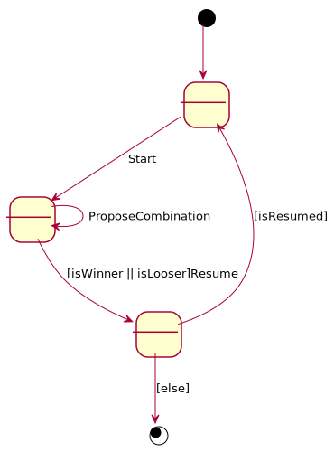

# Mastermind. Requisitos Gráficos
Universo Santa Tecla  
[uSantaTecla@gmail.com](mailto:uSantaTecla@gmail.com)  
  
**Índice**

1. [Requisitos](#requisitos)  
2. [Vista de Casos de Uso](#vista-de-casos-de-uso)  
2.1. [Prototipo de Interfaz](#prototipo-de-interfaz)  
2.1.1. [Gráfica](#grfica)  
2.1.2. [Consola](#consola)  
2.1.2.1. [Partida ganada](#partida-ganada)  
2.1.2.2. [Partida perdida](#partida-perdida)  
  
## Requisitos  

| [Wiki](https://en.wikipedia.org/wiki/Mastermind_(board_game)) - [Youtube](https://www.youtube.com/watch?v=2-hTeg2M6GQ&ab_channel=ViciadosMesa)<br/> * _Funcionalidad: **Básica**_<br/>  * _Interfaz: **Gráfica y Texto**_<br/>  * _Distribución: **Standalone**_<br/>  * _Persistencia: **No**_<br/> |  | 
| :------- | :------: |  

## Vista de Casos de Uso  

| Diagrama de Actores y Casos de Uso | Diagrama de Contexto |
|---|---|
|  |  |  

### Prototipo de Interfaz  

#### Gráfica

| Pantallas | Diálogos |
|---|---|
|  |  |

#### Consola

##### Partida ganada

```
----- MASTERMIND -----
****
Propose a combination: hybo
Wrong colors, they must be: rbygop
Propose a combination: rrbo
Repeated colors
Propose a combination: rybog
Wrong proposed combination length
Propose a combination: rybo
1 attempt(s):
****
rybo --> 1 blacks and 2 whites
Propose a combination: pybo
2 attempt(s):
****
rybo --> 1 blacks and 2 whites
pybo --> 1 blacks and 1 whites
Propose a combination: gybo
3 attempt(s):
****
rybo --> 1 blacks and 2 whites
pybo --> 1 blacks and 1 whites
gybo --> 1 blacks and 2 whites
Propose a combination: rgbo
4 attempt(s):
****
rybo --> 1 blacks and 2 whites
pybo --> 1 blacks and 1 whites
gybo --> 1 blacks and 2 whites
rgbo --> 0 blacks and 3 whites
Propose a combination: rygo
5 attempt(s):
****
rybo --> 1 blacks and 2 whites
pybo --> 1 blacks and 1 whites
gybo --> 1 blacks and 2 whites
rgbo --> 0 blacks and 3 whites
rygo --> 1 blacks and 3 whites
Propose a combination: oyrg
6 attempt(s):
****
rybo --> 1 blacks and 2 whites
pybo --> 1 blacks and 1 whites
gybo --> 1 blacks and 2 whites
rgbo --> 0 blacks and 3 whites
rygo --> 1 blacks and 3 whites
oyrg --> 4 blacks and 0 whites
You've won!!! ;-)
Do you want to continue? (s/n): 
```

##### Partida perdida

```
----- MASTERMIND -----
****
Propose a combination: hybo
Wrong colors, they must be: rbygop
Propose a combination: rrbo
Repeated colors
Propose a combination: rybog
Wrong proposed combination length
Propose a combination: rybo
1 attempt(s):
****
rybo --> 1 blacks and 2 whites
Propose a combination: pybo
2 attempt(s):
****
rybo --> 1 blacks and 2 whites
pybo --> 1 blacks and 1 whites
Propose a combination: gybo
3 attempt(s):
****
rybo --> 1 blacks and 2 whites
pybo --> 1 blacks and 1 whites
gybo --> 1 blacks and 2 whites
Propose a combination: rgbo
4 attempt(s):
****
rybo --> 1 blacks and 2 whites
pybo --> 1 blacks and 1 whites
gybo --> 1 blacks and 2 whites
rgbo --> 0 blacks and 3 whites
Propose a combination: rygo
5 attempt(s):
****
rybo --> 1 blacks and 2 whites
pybo --> 1 blacks and 1 whites
gybo --> 1 blacks and 2 whites
rgbo --> 0 blacks and 3 whites
rygo --> 1 blacks and 3 whites
Propose a combination: oyrg
6 attempt(s):
****
rybo --> 1 blacks and 2 whites
pybo --> 1 blacks and 1 whites
gybo --> 1 blacks and 2 whites
rgbo --> 0 blacks and 3 whites
rygo --> 1 blacks and 3 whites
oyrg --> 4 blacks and 0 whites
You've won!!! ;-)
Do you want to continue? (s/n): 
```
