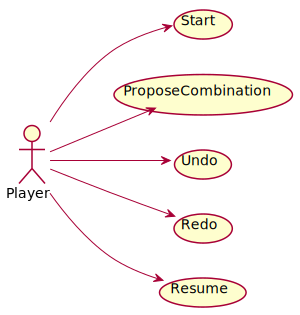
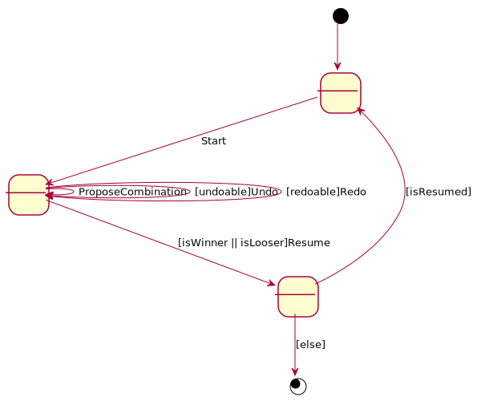

# Mastermind. Requisitos Undo/Redo
Universo Santa Tecla  
[uSantaTecla@gmail.com](mailto:uSantaTecla@gmail.com)  
  
**Índice**

1. [Requisitos](#requisitos)  
2. [Vista de Casos de Uso](#vista-de-casos-de-uso)  
2.1. [Prototipo de Interfaz](#prototipo-de-interfaz)  
  
## Requisitos  

| [Wiki](https://en.wikipedia.org/wiki/Mastermind_(board_game)) - [Youtube](https://www.youtube.com/watch?v=2-hTeg2M6GQ&ab_channel=ViciadosMesa)<br/> * _Funcionalidad: **Básica + Undo/Redo**_<br/>  * _Interfaz: **Gráfica y Texto**_<br/>  * _Distribución: **Standalone**_<br/>  * _Persistencia: **No**_<br/> |  | 
| :------- | :------: |  

## Vista de Casos de Uso  

| Diagrama de Actores y Casos de Uso | Diagrama de Contexto |
|---|---|
|  |  |  

### Prototipo de Interfaz  

```
----- MASTERMIND ----
****
----- Choose one option ----
1. Propose Combination
rybo
FORMAT ERROR! Enter a integer formatted value.
1
Propose a combination: rybo
1 attempt(s):
rybo --> 0 blacks and 2 whites
----- Choose one option ----
1. Propose Combination
2. Undo previous Proposal
2
0 attempt(s):
----- Choose one option ----
1.Propose Combination
2. Redo previous Proposal
1
Propose a combination: pybo
1 attempt(s):
pybo --> 1 blacks and 2 whites
----- Choose one option ----
1. Propose Combination
2. Undo previous Proposal
1
Propose a combination: gybo
2 attempt(s):
pybo --> 1 blacks and 2 whites
gybo --> 0 blacks and 3 whites
----- Choose one option ----
1. Propose Combination
2. Undo previous Proposal
1
Propose a combination: pgbo
3 attempt(s):
pybo --> 1 blacks and 2 whites
gybo --> 0 blacks and 3 whites
pgbo --> 2 blacks and 1 whites
----- Choose one option ----
1. Propose Combination
2. Undo previous Proposal
1
Propose a combination: pgyo
4 attempt(s):
pybo --> 1 blacks and 2 whites
gybo --> 0 blacks and 3 whites
pgbo --> 2 blacks and 1 whites
pgyo --> 3 blacks and 0 whites
----- Choose one option ----
1. Propose Combination
2. Undo previous Proposal
2
3 attempt(s):
pybo --> 1 blacks and 2 whites
gybo --> 0 blacks and 3 whites
pgbo --> 2 blacks and 1 whites
----- Choose one option ----
1. Propose Combination
2. Undo previous Proposal
3. Redo previous Proposal
2
2 attempt(s):
pybo --> 1 blacks and 2 whites
gybo --> 0 blacks and 3 whites
----- Choose one option ----
1. Propose Combination
2. Undo previous Proposal
3. Redo previous Proposal
3
3 attempt(s):
pybo --> 1 blacks and 2 whites
gybo --> 0 blacks and 3 whites
pgbo --> 2 blacks and 1 whites
----- Choose one option ----
1. Propose Combination
2. Undo previous Proposal
3. Redo previous Proposal
3
4 attempt(s):
pybo --> 1 blacks and 2 whites
gybo --> 0 blacks and 3 whites
pgbo --> 2 blacks and 1 whites
pgyo --> 3 blacks and 0 whites
----- Choose one option ----
1.Propose Combination
2. Undo previous Proposal
1
Propose a combination: pgyb
5 attempt(s):
pybo --> 1 blacks and 2 whites
gybo --> 0 blacks and 3 whites
pgbo --> 2 blacks and 1 whites
pgyo --> 3 blacks and 0 whites
pgyb --> 4 blacks and 0 whites
You've won!!! ;-) 
Do you want to continue? (y/n):
```
