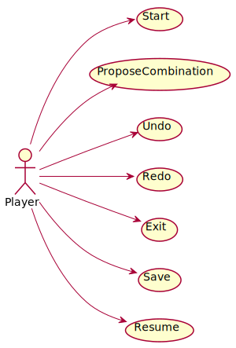
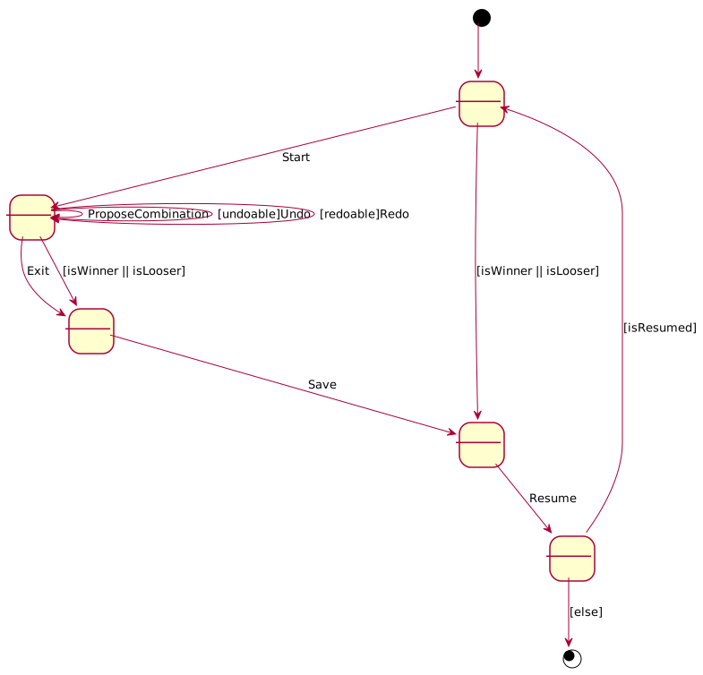

# Mastermind. Requisitos Ficheros
Universo Santa Tecla  
[uSantaTecla@gmail.com](mailto:uSantaTecla@gmail.com)  
  
**Índice**

1. [Requisitos](#requisitos)  
2. [Vista de Casos de Uso](#vista-de-casos-de-uso)  
2.1. [Prototipo de Interfaz](#prototipo-de-interfaz)  
  
## Requisitos  

| [Wiki](https://en.wikipedia.org/wiki/Mastermind_(board_game)) - [Youtube](https://www.youtube.com/watch?v=2-hTeg2M6GQ&ab_channel=ViciadosMesa)<br/> * _Funcionalidad: **Básica + Undo/Redo**_<br/>  * _Interfaz: **Gráfica y Texto**_<br/>  * _Distribución: **Standalone + Client/Server**_<br/>  * _Persistencia: **Ficheros**_<br/> |  | 
| :------- | :------: |  

## Vista de Casos de Uso  

| Diagrama de Actores y Casos de Uso | Diagrama de Contexto |
|---|---|
|  |  |  

### Prototipo de Interfaz  

```
----- MASTERMIND ---------
Choose one option ----
1. Start a new game
2. Open a saved game
1
0 attempt(s):
----- Choose one option ----
1. Propose Combination
2. Exit game
1
Propose a combination: rybo
1 attempt(s):
rybo --> 0 blacks and 3 whites
----- Choose one option ----
1. Propose Combination
2. Undo previous Proposal
3. Exit game
3
1 attempt(s):
rybo --> 0 blacks and 3 whites
Do you want to save the game?? (y/n): y
Name: game1
Do you want to continue? (y/n): y


----- MASTERMIND ---------
---- Choose one option ----
1. Start a new game
2. Open a saved game
2
----- Choose one option ----
1. game1.mm
1
game1.mm
1 attempt(s):
rybo --> 0 blacks and 3 whites
----- Choose one option ----
1. Propose Combination
2. Exit game
1
Propose a combination: pybo
2 attempt(s):
rybo --> 0 blacks and 3 whites
pybo --> 0 blacks and 3 whites
----- Choose one option ----
1. Propose Combination
2. Undo previous Proposal
3. Exit game
1
Propose a combination: rpbo
3 attempt(s):
rybo --> 0 blacks and 3 whites
pybo --> 0 blacks and 3 whites
rpbo --> 0 blacks and 3 whites
----- Choose one option ----
1. Propose Combination
2. Undo previous Proposal
3. Exit game
1
Propose a combination: rypo
4 attempt(s):
rybo --> 0 blacks and 3 whites
pybo --> 0 blacks and 3 whites
rpbo --> 0 blacks and 3 whites
rypo --> 0 blacks and 3 whites
----- Choose one option ----
1. Propose Combination
2. Undo previous Proposal
3. Exit game
1
Propose a combination: rybp
5 attempt(s):
rybo --> 0 blacks and 3 whites
pybo --> 0 blacks and 3 whites
rpbo --> 0 blacks and 3 whites
rypo --> 0 blacks and 3 whites
rybp --> 1 blacks and 3 whites
----- Choose one option ----
1. Propose Combination
2. Undo previous Proposal
3. Exit game
1
Propose a combination: bryp
6 attempt(s):
rybo --> 0 blacks and 3 whites
pybo --> 0 blacks and 3 whites
rpbo --> 0 blacks and 3 whites
rypo --> 0 blacks and 3 whites
rybp --> 1 blacks and 3 whites
bryp --> 1 blacks and 3 whites
----- Choose one option ----
1. Propose Combination
2. Undo previous Proposal
3. Exit game
1
Propose a combination: ybrp
7 attempt(s):
rybo --> 0 blacks and 3 whites
pybo --> 0 blacks and 3 whites
rpbo --> 0 blacks and 3 whites
rypo --> 0 blacks and 3 whites
rybp --> 1 blacks and 3 whites
bryp --> 1 blacks and 3 whites
ybrp --> 4 blacks and 0 whites
You've won!!! ;-)
Do you want to save the game?? (y/n): n
Do you want to continue? (y/n):
```
